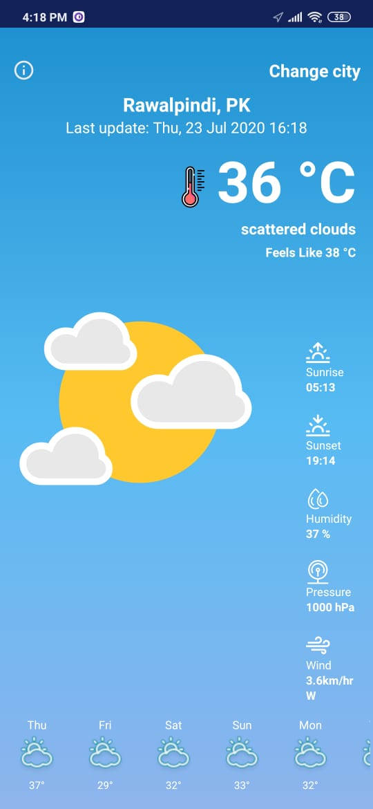
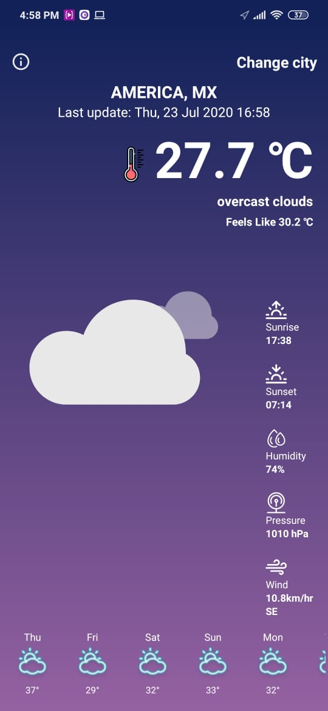

# DailyWeather
This ia a native android app develop using Open Weather API. It forecasts current weather as well I have implemented 5 days forecast wetaher .
DailyWeather grabs the current location of user and , based on user's location weahter is forecaseted and displayed.
Moreover , user can change city to preview weather of other cities.

## Animations and Background
To display different weather conditions I used https://lottiefiles.com/ and grab some weather animations from here.
The app also changes its day and night time based on sunset and sunrise value.
## Animated Splash Screen

## Current Weather with 5 Days Forecast

## Current Weather of searched city with 5 Days Forecast
User can change city to check out weather of different cities.

